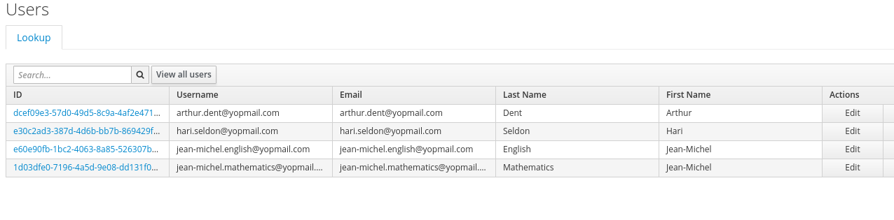

## Spring Boot Rest API with Oauth2 & Keycloak

#### Start/Stop Keycloak

```shell script
# Start
docker run -d -p 8081:8080 --rm --name=keycloak \
-e KEYCLOAK_USER=admin \
-e KEYCLOAK_PASSWORD=admin \
-e DB_VENDOR=h2 jboss/keycloak

# Stop
docker stop keycloak
```

#### Configure Keycloak
1) Login and create a Realm (name : dev)

2) Create a client (Client ID : registration-service, Client Protocol : openid-connect)

3) Client Settings :\


4) Create the following users (see [data.sql](src/main/resources/db/data.sql) for the role to set):\


5) Create a token with postman :\


#### Tests with Postman
###### Without authentication
* 200 : http://localhost:8080/registration/teacher/1/
* 401 : http://localhost:8080/registration/student/6/

###### Logged in with hari.seldon@yopmail.com
* 200 : http://localhost:8080/registration/student/6/
* 200 : http://localhost:8080/registration/register?student_email=hari.seldon@yopmail.com&lesson_id=4
* 403 : http://localhost:8080/registration/register?student_email=arthur.dent@yopmail.com&lesson_id=4
* 403 : http://localhost:8080/registration/grade?student_id=6&lesson_id=5&grade=C

###### Logged in with jean-michel.english@yopmail.com
* 200 : http://localhost:8080/registration/student/6/
* 200 : http://localhost:8080/registration/grade?student_id=6&lesson_id=5&grade=C

###### Logged in with jean-michel.mathematics@yopmail.com
* 200 : http://localhost:8080/registration/student/6/
* 403 : http://localhost:8080/registration/grade?student_id=6&lesson_id=5&grade=C
